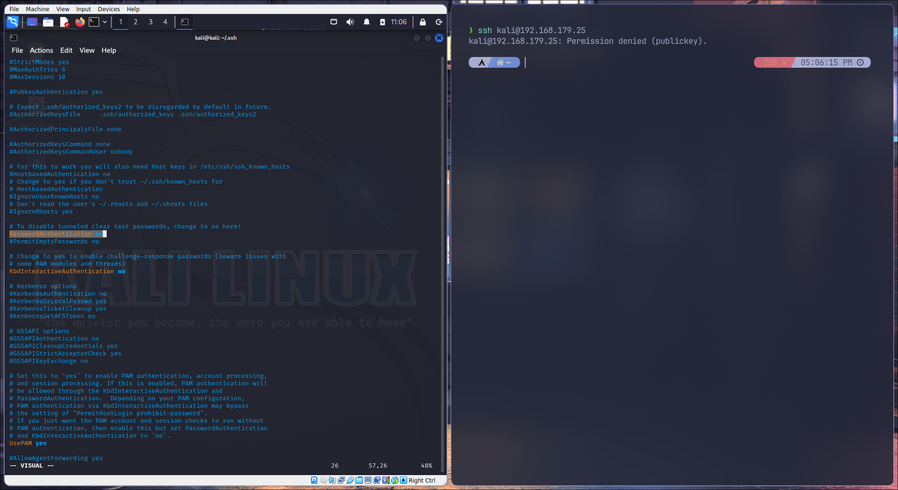
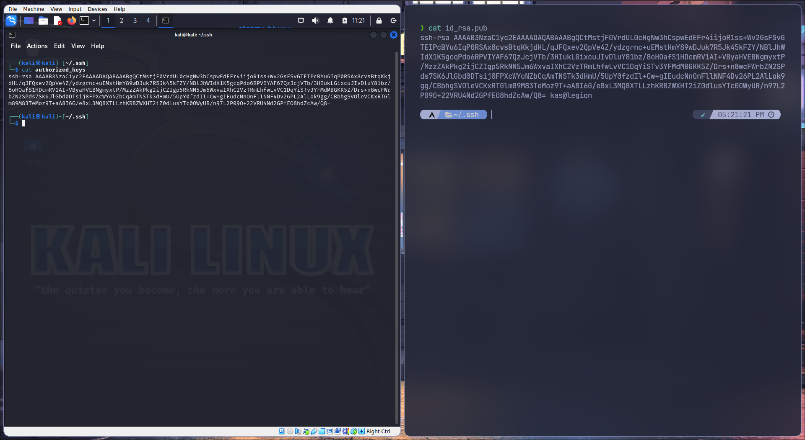
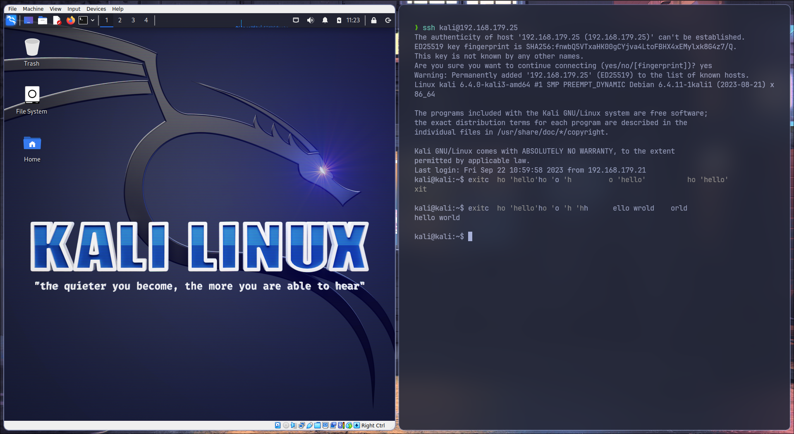
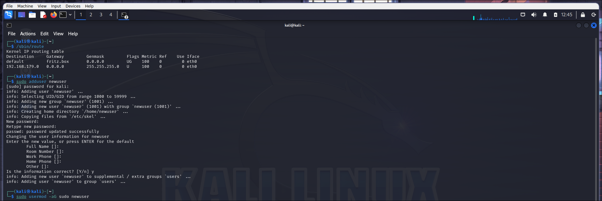
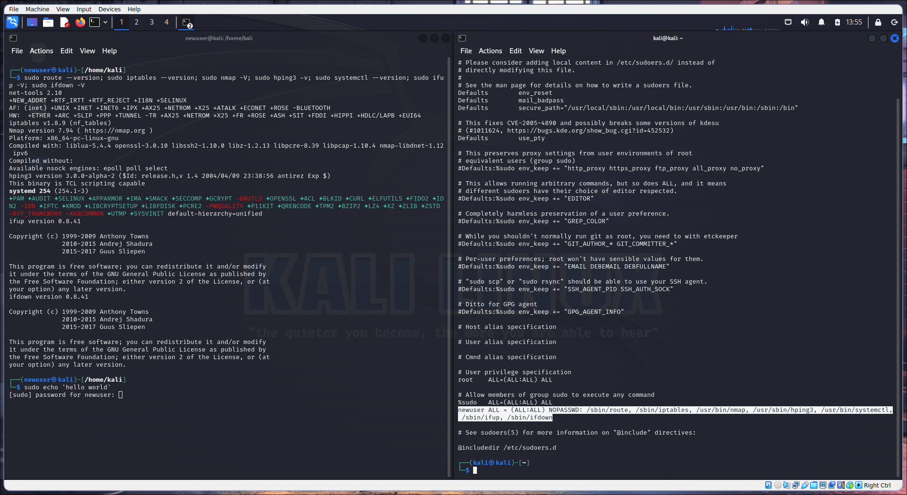
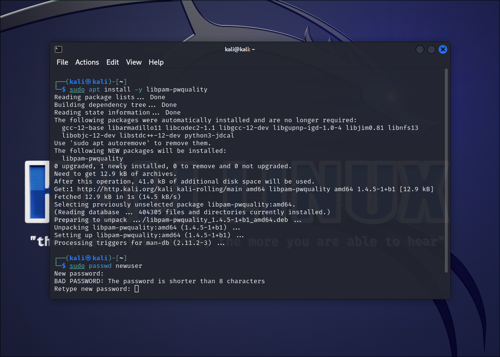
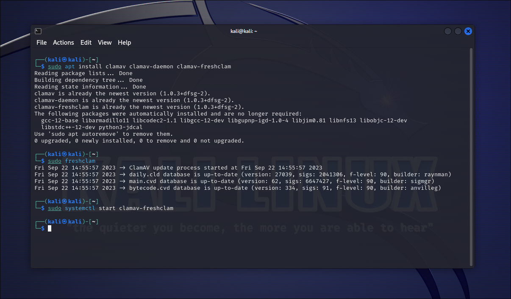
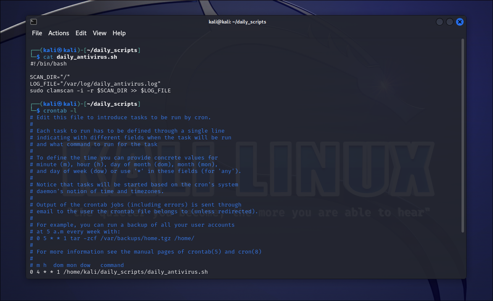
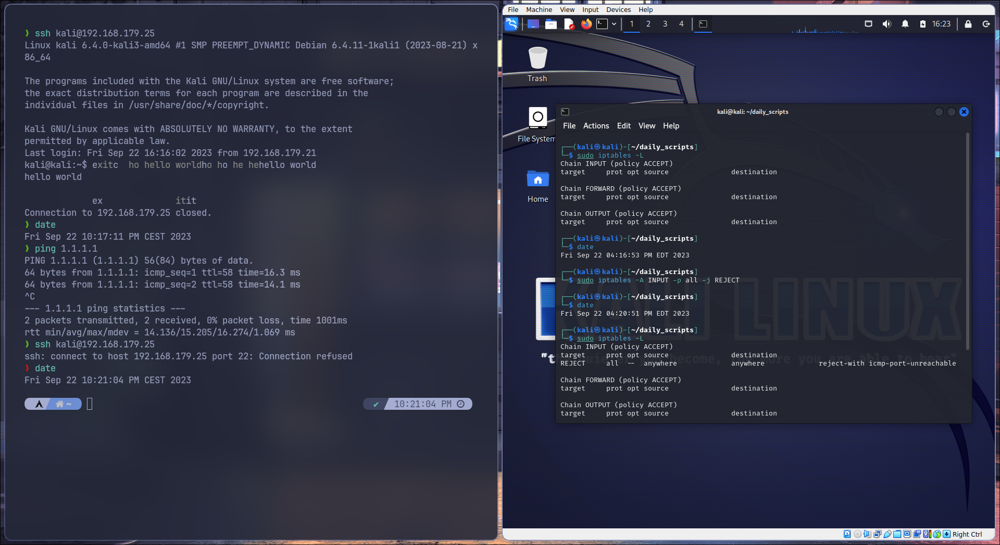

# SSH

Для начала я убрал аутентификацию по паролю (и теперь без ключей сервер не выдаёт доступ вообще).

Далее обменялся ключами между машинами.

Собственно, теперь всё работает.

# Пользователь

С фантазией у меня не очень, по сему я создал нового пользователя newuser с одноимённой домашней директорией, а так же внёс его в группу sudo. Ну и разумеется требуемые команды от его имени можно запускать без пароля (как видите на втором скришноте, все команды, требуемые в задаче он запускает без запроса пароля, а на команду echo 'hello world' требует пароль).

Есть один замечтаельный pam модуль, который по умолчанию имеет ограничение на пароль не меньше 8 символов, по этому установить это ограничение вообще не составило труда.

# ОС Linux

В качестве антивируса я выбрал сканер clamav. Установил, обновил базы данных и включил сервис.

Создал скрипт daily_antivirus.sh (хоть он и был уже на уроках, решил написать заново дабы освежить память) и занёс его в crontab.

Так же я настроил firewall (я выбрал iptables в качестве файервола). Команды date и ping нужны для демонстрации того, что не было жульничества (что одна команда была сделана позже другой, а так же что некоторые из них выполнялись приблизительно в одно время, команда ping нужна что бы показать наличие соеденинения с интернетом).
