# Объекты

Вот практичкески все объекты, которые я создал:

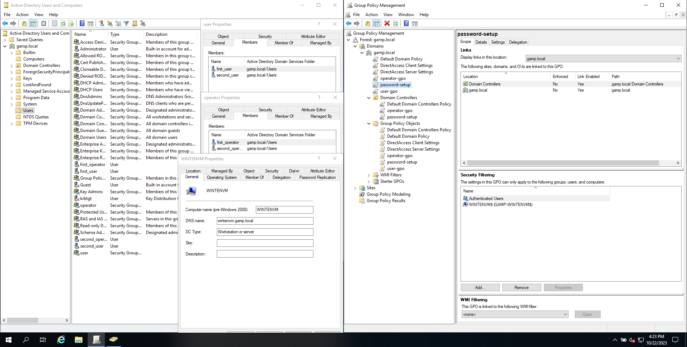

# Политика паролей

Поскольку максимальный срок жизни пароля 45 дней (по условиям задачи), и при этом пользователь не должен менять пароль, то я установил минимальный срок жизни пароля 45 дней, а максимальный 46. Это значит, что до прошествия 45 дней пользователь не сможет менять пароль, а на следующий день он станет недействительным.

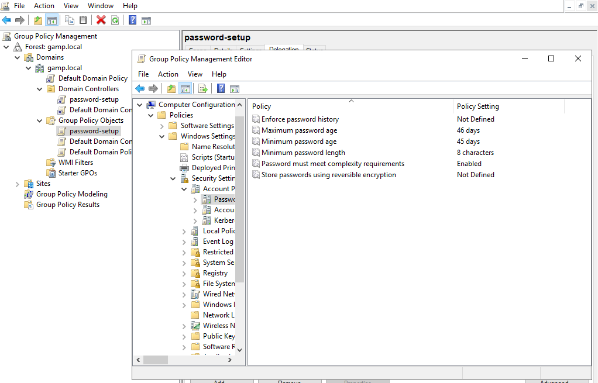

Так же я поставил запрет на смену пароля "пользователем" вручную.

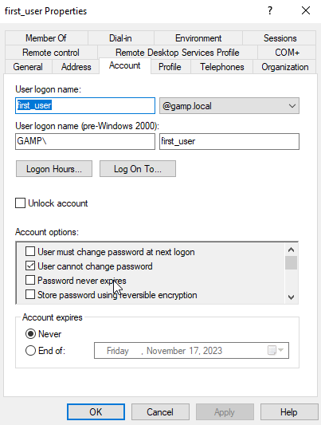

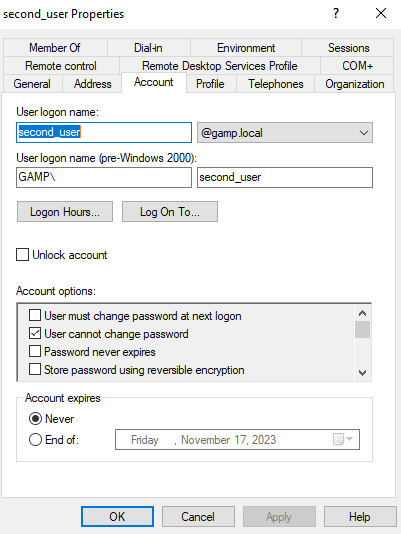

# Пользователь

Картинка рабочего стола, а так же результат вывода команды gpresult /r.

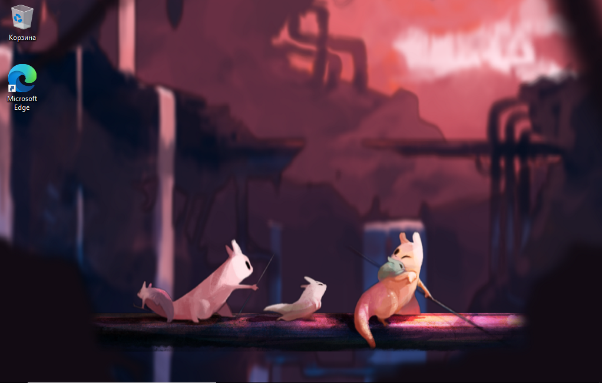

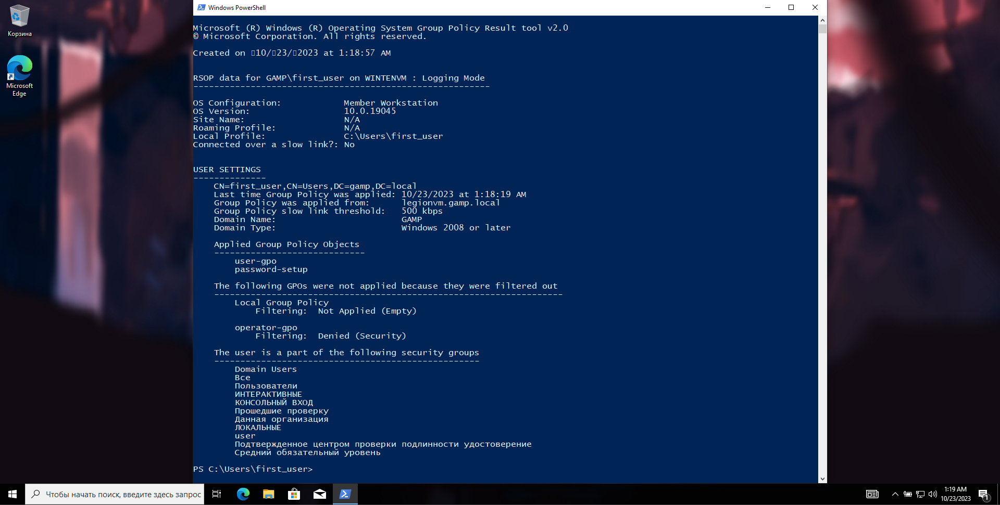

А так же запрет на редактирование реестра windows.

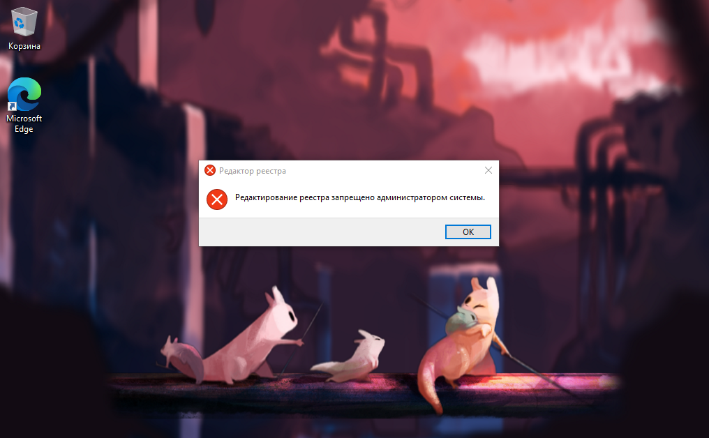

# Оператор

Картинка рабочего стола, а так же результат вывода команды gpresult /r.

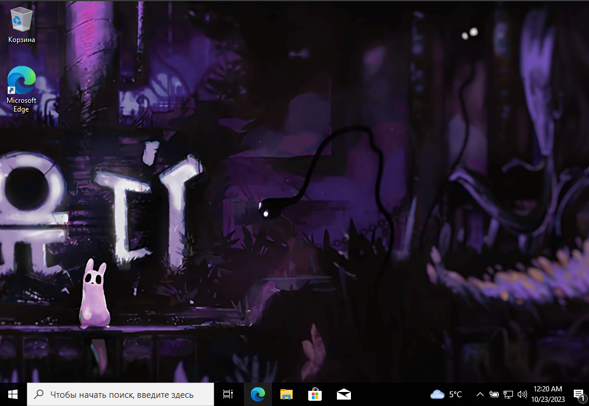

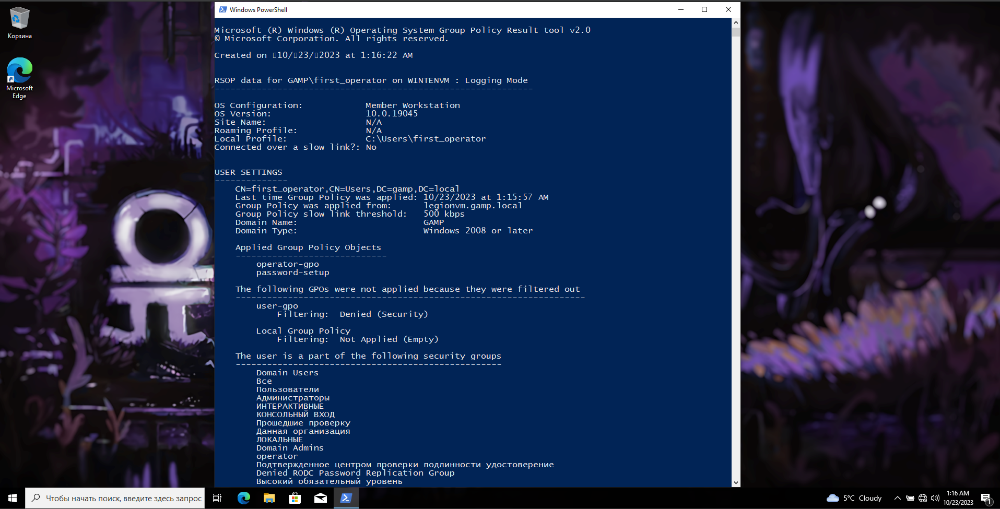

А так же запуск powershell при входе в учётную запись оператора.

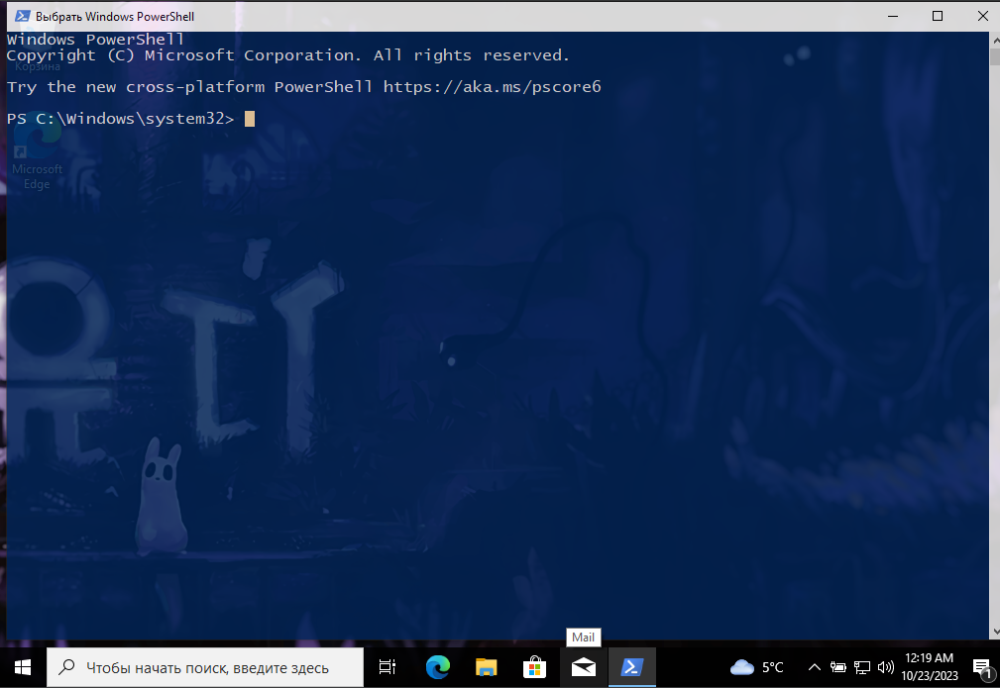

# KDC Armoring

KDC активирован успешно.

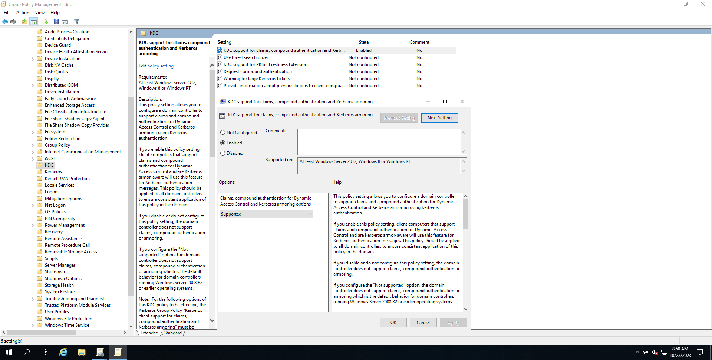

А так же значение TheMachineAccountQuota поставлено на "5".

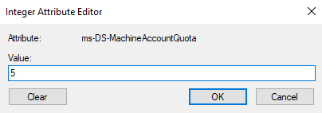
