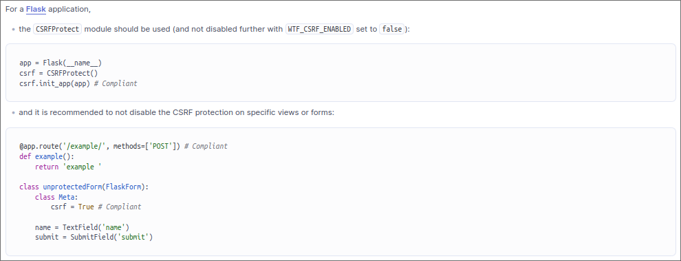
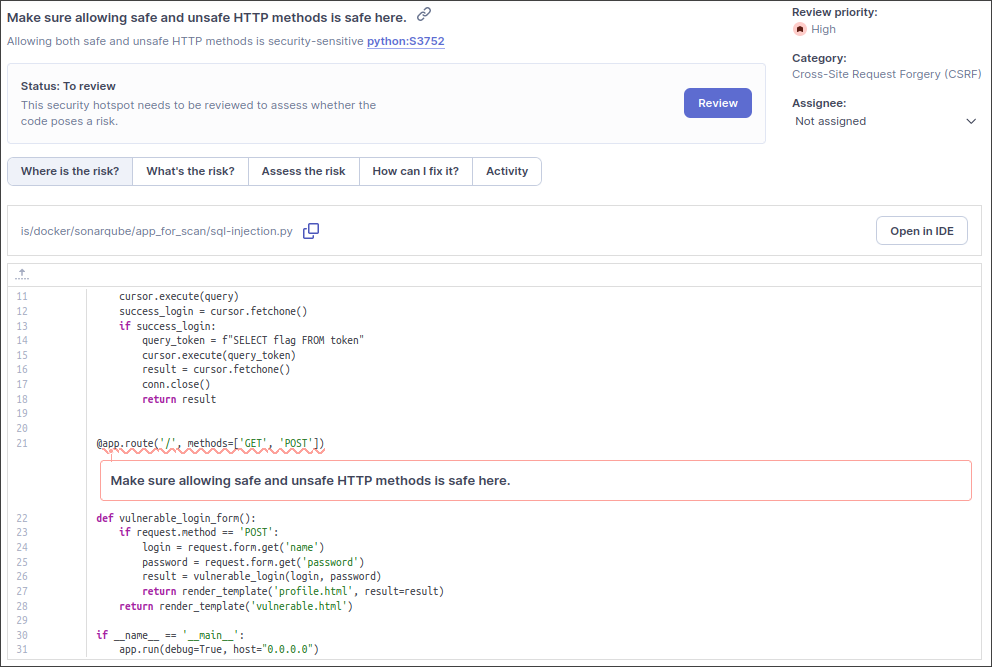

# Практическая работа с Sonarqube

В требовании задания вы установили запустить два docker контейнера вручную (то есть командой с кучей аргументов). Лично я не вижу в этом смысла, так как специально для подобных случаев был создан `docker-compose`, так что я перенёс все настройки контейнеров в конфигурационный файл `docker-compose.yml`, так что в итоге запуск всех контейнеров и их настройка свелись к одной команде `sudo docker-compose up`. Всё, что касается docker файлов вы можете найти в папке `dockerfiles`.

Я решил создать проект с именем `hello`, и произвести в нём все требуемые тесты. В запуске sonar в инструкции опять требовалось запустить команду с кучей аргументов, по этому я создал конфигурационный файл `sonar-scanner.properties` (его вы можете найти в папке `configs`, впишите в квадратные скобки ваши данные), и в итоге вся команда запуска, аутентификация в проекте и настройка сканнера sonarqube свелась к одной команде `sudo sonar-scanner`.

## Результаты сканирования

Тут всё сработало как и ожидалось, только вместо двух ошибок в работе программы нашлось три. 

Ниже будет предоставлен скриншот уязвимости, её описание и рекомендации по устранению.

### CSRF

> A cross-site request forgery (CSRF) attack occurs when a trusted user of a web application can be forced, by an attacker, to perform sensitive actions that he didn’t intend, such as updating his profile or sending a message, more generally anything that can change the state of the application.
> The attacker can trick the user/victim to click on a link, corresponding to the privileged action, or to visit a malicious web site that embeds a hidden web request and as web browsers automatically include cookies, the actions can be authenticated and sensitive.

### Unsafe HTTP methods

> An HTTP method is safe when used to perform a read-only operation, such as retrieving information. In contrast, an unsafe HTTP method is used to change the state of an application, for instance to update a user’s profile on a web application.
> Common safe HTTP methods are GET, HEAD, or OPTIONS.
> Common unsafe HTTP methods are POST, PUT and DELETE.
> Allowing both safe and unsafe HTTP methods to perform a specific operation on a web application could impact its security, for example CSRF protections are most of the time only protecting operations performed by unsafe HTTP methods.

### Enabling debug feature

> Development tools and frameworks usually have options to make debugging easier for developers. Although these features are useful during development, they should never be enabled for applications deployed in production. Debug instructions or error messages can leak detailed information about the system, like the application’s path or file names.

## Заключение

Все вышеперечисленные уязвимости были устранены в соответствии с рекомендациями.

В папку `sources` я закинул сканируемый код (который вы дали в практическом задании), а так же отредактированный код, в котором уязвимости были устранены (там в итоге нашлись ещё, но это уже не касается задания, поскольку суть была именно в устранении http запросов и csrf уязвимостей), файл с отредактированным кодом называется `sql-injection_redacted.py`. Если хотите воспроизвести работу сервера, то просто зайдите в директорию `dockerfiles` и напишите в ней `sudo docker-compose up`.
