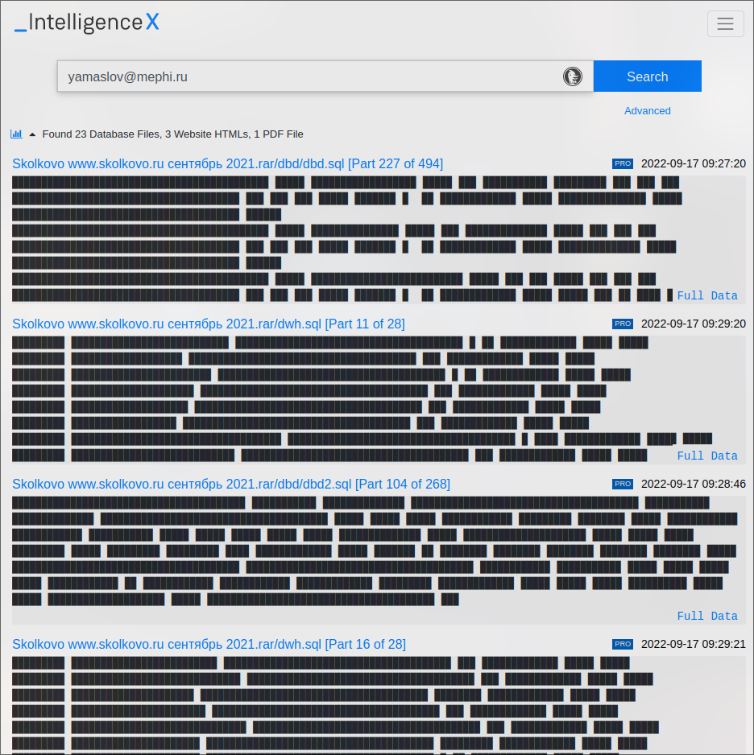
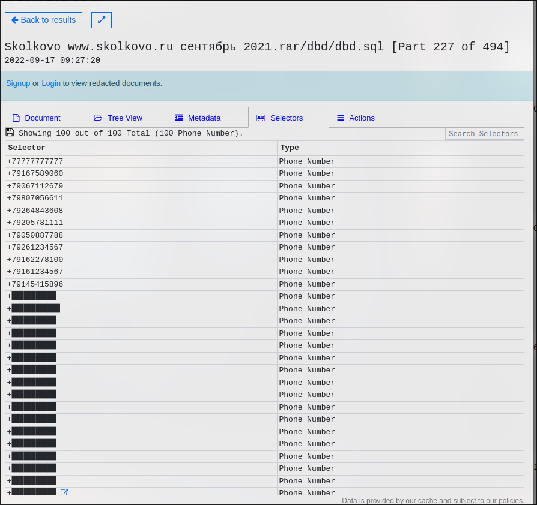

# Сбор информации об университете МИФИ

## 1. Глобальная информация

> Используемые утилиты: [whois](https://www.whois.com/whois/), [shodan](https://www.shodan.io/).

Из whois узнал адреса айпи серверов, и просканировал их с помощью shodan.

## 2. Данные о физических лицах

> Используемые утилиты: [list-org](https://www.list-org.com/), [egrul_bot](https://telegra.ph/Instrukciya-k-egrul-bot-11-19).

Из list-org достал список сотрудников.

Затем узнал информацию по сотрудникам с помощью этой же утилиты об учредителе.

А так же об остальных сотрудниках.

А так же использовал телеграмм бота egrul.

## 3. Электронные почты

> Используемые утилиты: [anymailfinder](https://anymailfinder.com/), [epieos](https://epieos.com/), [intelx](https://intelx.io/), [avatarapi](https://www.avatarapi.com/), [emailrep](https://emailrep.io/), [haveibennpwned](https://haveibeenpwned.com/)

Для начала я вытащил эмейлы из сайта с помощью anymailfinder.

Затем начал проверять разные эмейлы разными утилитами.

