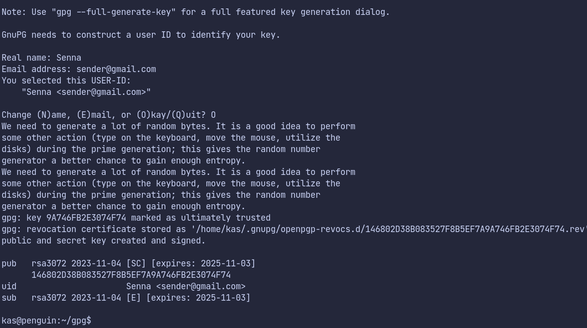
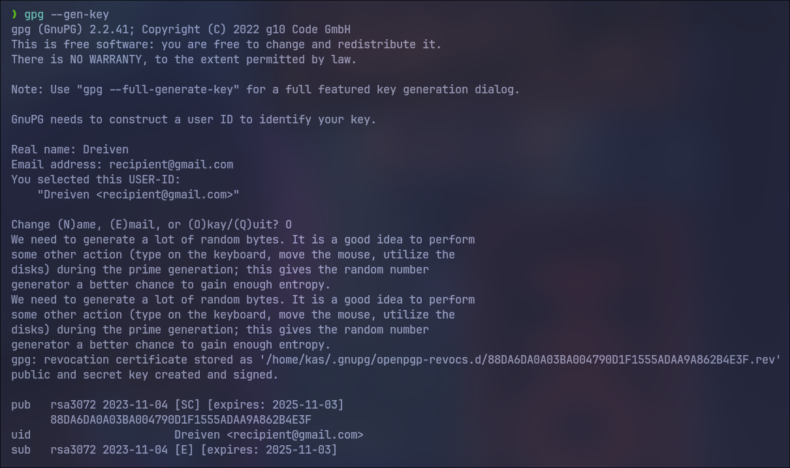
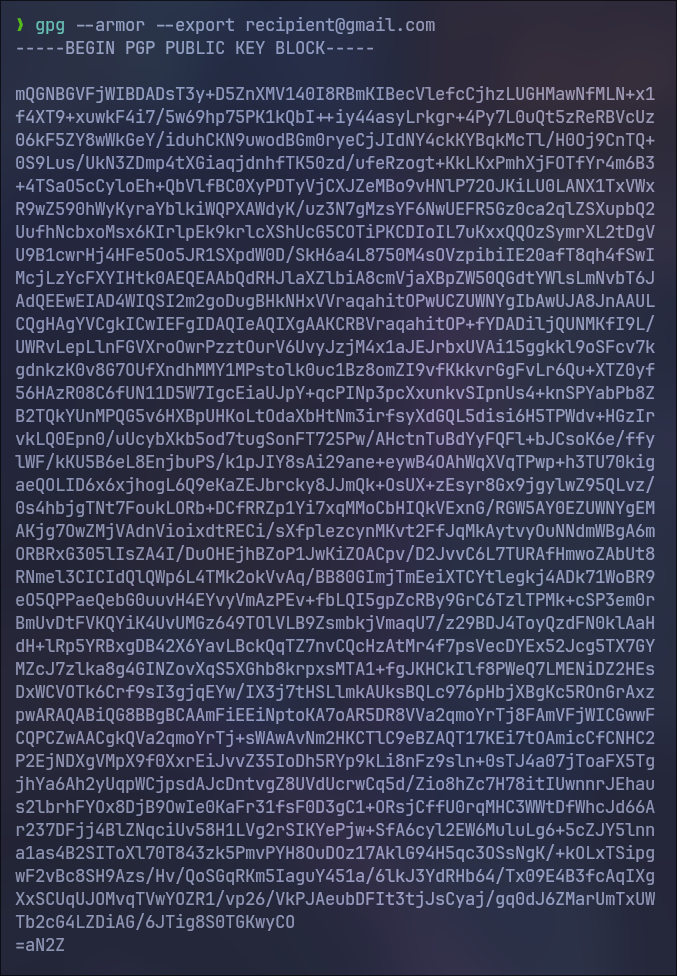
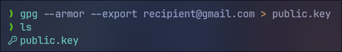
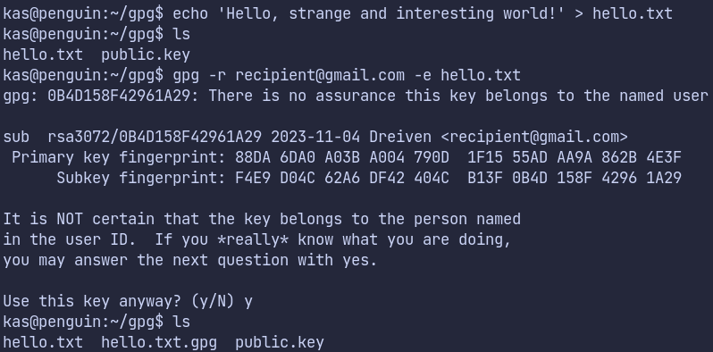
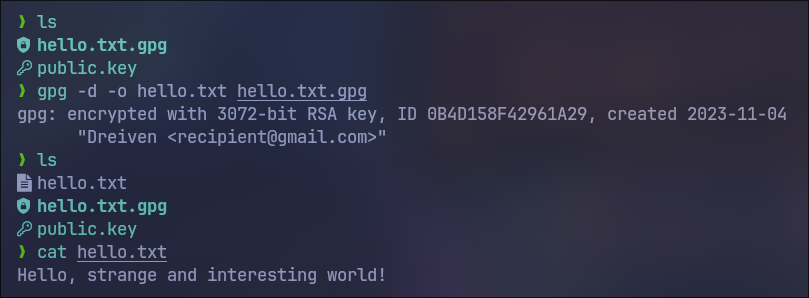

# Отчёт о шифровке и расшифровке gpg файла

## Подготовка

С начала создаётся ключ отправителя.

Затем получателя.

Демонстрация публичного ключа.

Публичный ключ получателя отправляется отправителю для дальнейшего шифрования.

## Шифровка и расшифровка файла

Отправитель шифрует файл, используя публичный ключ получателя.

После получения файла, получатель расшифровывает его.

