# Juice Shop практика

Juice Shop - утилита, представляющая собой докер контейнер с сервером, на котором находится большое количество уязвимостей. Утилита создана для обучаяющих целей и предназначена для оттачивания навыков по информационной безопаности. 

## Static analysis

Начнём со статического анализа кода. Это не совсем целесообразно, так как в утилите и так присутсвуют специально созданные уязвимости, однако это отличный тест программы semgrep, чтобы проверить утилиту для статического сканирования кода в деле. Уязвимостей было найдено огромное количество, вот команда и некоторые из уязвимостей.

``` bash
semgrep scan
```

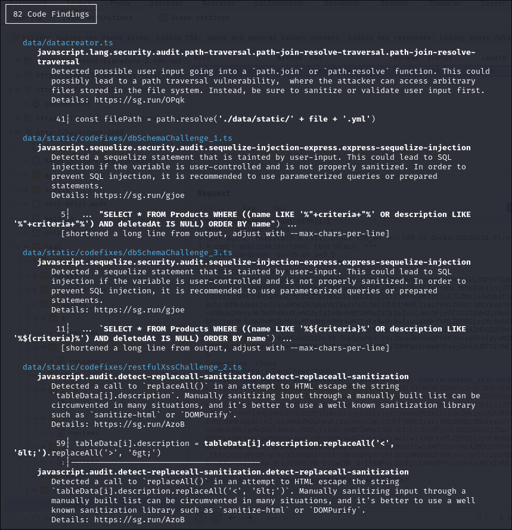

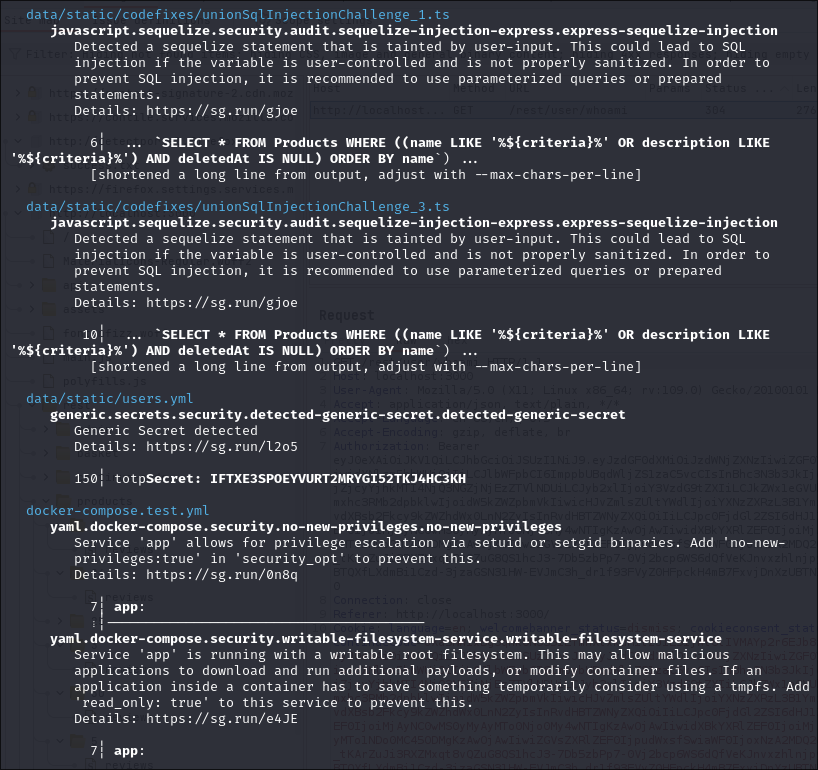

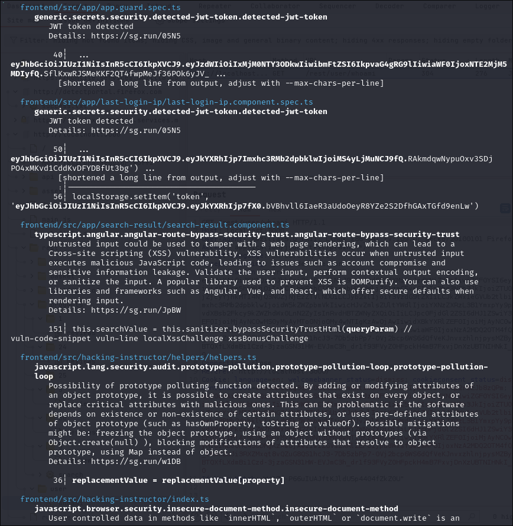

## Broken access control

Хотел бы начать с нарушения контроля доступа. Эта уязвимость находится на вершине списка уязвимостей. В данном случае будет воспроизводится эскалация горизонтального доступа путём имерсонификации http протокола. В данном случае результатом эксплуатации этой уязвимости будет публикация отзыва о продукте от имени другого пользователя (к которому изначально у нас нет доступа). 

Попробуем сделать отзыв от имени пользователя jim.

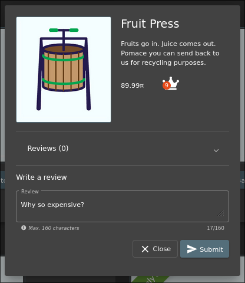

Затем смотрим как запрос выглядет в burp suite.

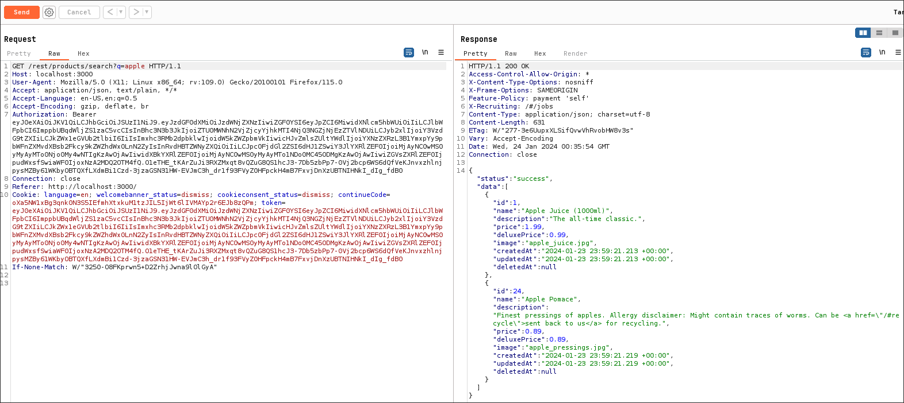

Как можно увидеть, никаких параметров, которые можно напрямую редактировать (которые не зашифрованы) нет. Однако это GET запрос. По этому можно попытаться выполнить intercept, чтобы зафиксировать запрос, который отправляется непосредственно при нажатии кнопки "Submit". 

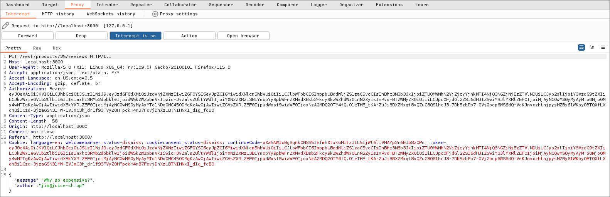

Теперь запрос перехвачен. Осталось попытаться изменить данные в теле запроса, чтобы выполнить имперсонификацию.

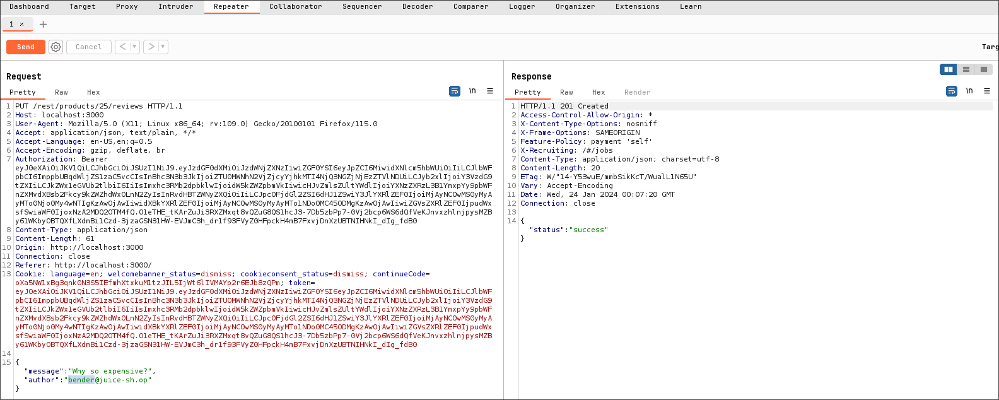

Проверяем результат на сайте.

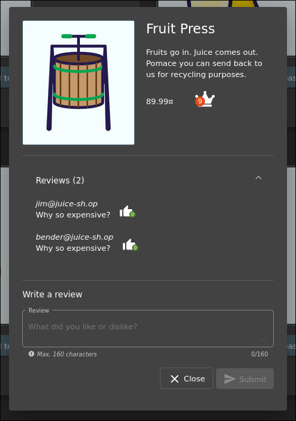

Из этого можно сделать вывод, что на сайте отсутсвует авторизация запроса, что приводит к возможности эксплуатации уязвимости горизонтальной эскалации доступа. 

> Для устранения подобных уязвимостей необходимо проводить авторизацию пользователя при подобном запросе (в данном случае достаточно лишь сравнить логин пользователя с логином пользователя в запросе).

## Инъекции

Следующая уязвимость идёт второй в списке после уязвимости контроля доступа в OWASP Top-10. Для начала надо найти жертву (имя пользователя).

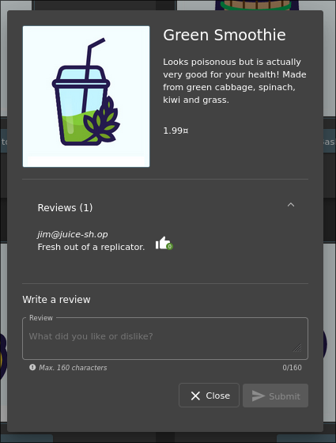

Можно попробовать закомментировать имя пользователя в поле для логина, что бы проверить уязвим ли сайт к sql инъекциям.

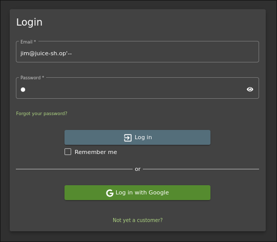

Как мы видим - сайт уязвим к sql инъекциям. Вот выполненное задания на juice shop в качестве доказательства того, что показанная выше sql инъекция сработала.

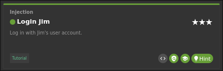

Имя пользователя "admin" начинается на a, соотвественно велика вероятность того, что пользователь admin находится в начале базы данных пользователей (так как вероятная сортировка по алфавиту). Попробуем прописать пустой запрос с гарантированным условием, что бы нам выдало список всех пользователей. Не исключено, что сервер при получении списка пользователей возьмёт самого первого в алфавитном порядке.

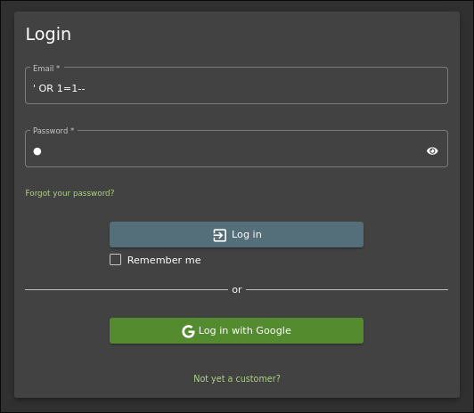

Как мы видим, сайт так же уязвим так же и к пустому запросу с гарантированным условием. То есть на сайте можно зайти на аккаунт администратора не зная ни логина, ни пароля. Вот доказательство того, что показанная выше sql инъекция сработала.

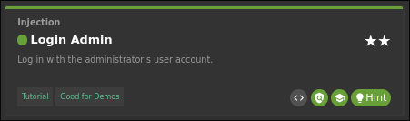

### Критическая инъекция

С помощью следующей уязвимости можно получить полный доступ к данным сайта, с возможностью редактирования оных. Для начала зайдём в список продуктов и попробуем сделать запрос.

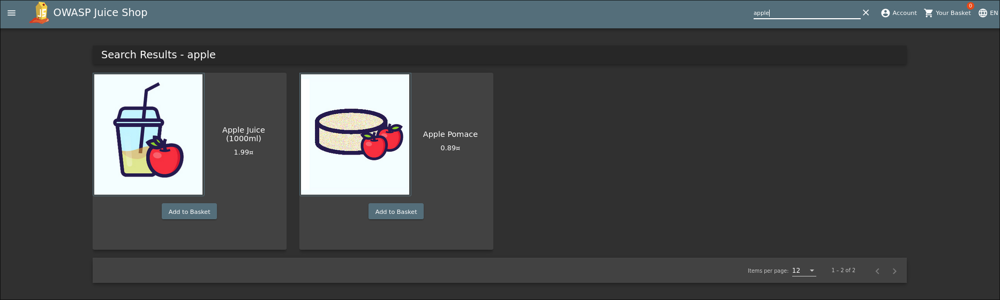

Как видим, нам выдало результаты поиска на слово "apple". Теперь можно посмотреть структуру запроса в burp suite и проверить на уязвимость к sql инъекциям.

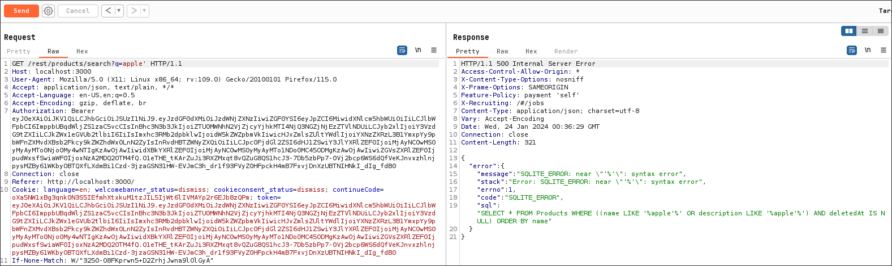

Как можно видеть, сайт не только выдал другой результат на попытку сделать инъекцию, но ещё и выдал sql запрос, который используется при поиске продуктов. Это значит, что теперь у нас есть подробные данные. Как можно видеть из sql запроса, сайт проверяет, что бы объявление о товаре не было удалено. Попробуем вывести удалённые объявления товаров. 

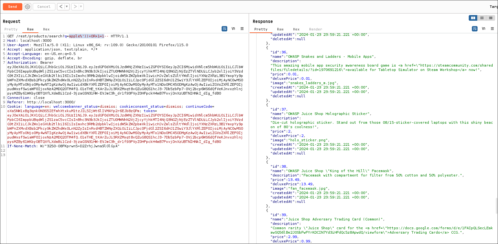

Теперь можно окончательно убедиться, что сайт уязвим к sql инъекциям. Попробуем ввести инъекцию с использованием UNION. Однако количество столбцов, выводимым юнионом должно совпадать с количеством столбцом оригинального запроса. Попробуем выяснить сколько значений выводит sql запрос с помощью сортировки ORDER BY.

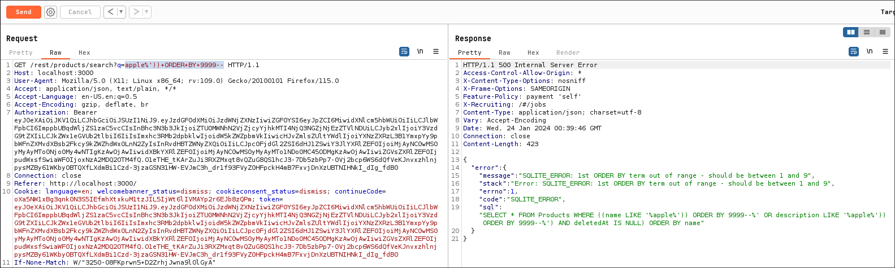

Исходя из текста ошибки можно сделать вывод, что количество столбцов равно 9. Теперь можно ввести инъекцию с использованием UNION.

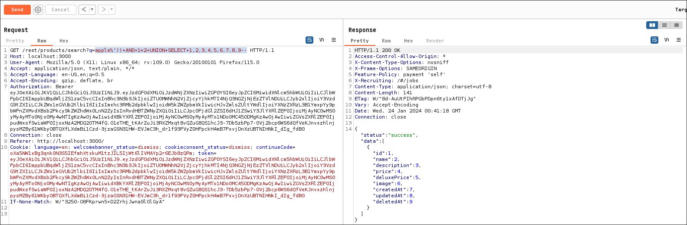

Из результата ответа на запрос можем сделать вывод, что у нас получилось ввести UNION инъекцию. В предыдущих ошибках можно увидеть, что на сервере используется СУБД sqlite. В этой СУБД есть мастер таблица, в которой хранится информация о таблицах, включая запросы, которые использовались для их создания.

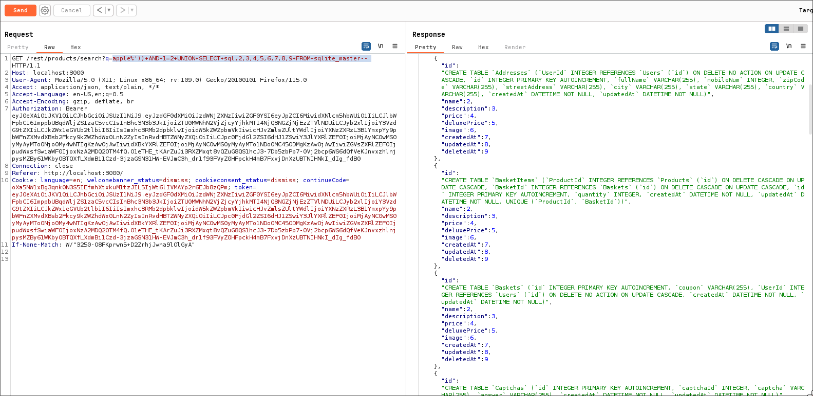

Давайте подытожим что даёт всё вышеперечисленное. На наших руках все параметры всех таблиц базы данных, типы данных, которые в них используются, а так же возможность написать любой SQL запрос. То есть нам известны все данные, а так же возможность их изменять. Это уязвимость, которую можно считать критической, так как мы можем зайти от имени любого пользователя или удалить абсолютно любую публикацию. Проще говоря у нас есть практически вся власть над сайтом. 

> Для устранения подобных уязвимостей рекомендовано использовать параметризированные запросы.
